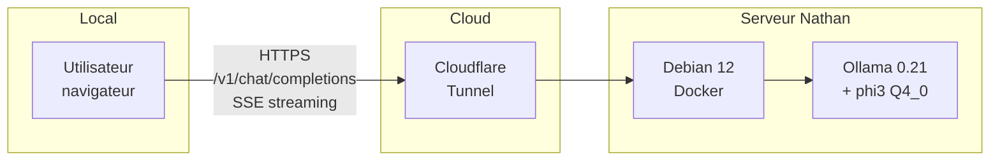

# TechCorp — Phi-3.5-Financial Assistant 🏦

> Hackathon IA inter-filières (Ynov M1) — Groupe 4 — 24/04/2026
> **Mission** : reprendre le projet compromis de l'équipe précédente et livrer un assistant financier sécurisé.

> 📄 Le briefing original de TechCorp est conservé dans [BRIEF_ORIGINAL.md](BRIEF_ORIGINAL.md).

---

## 🚀 Démarrage rapide (3 minutes)

### 1. Lancer l'interface web (zéro dépendance)

```bash
cd webapp
python3 -m http.server 8080
# puis ouvrir http://localhost:8080
```
...
L'interface se connecte par défaut au tunnel public Cloudflare où tourne notre serveur Ollama. Modifiable dans le panneau **⚙️ Paramètres** de l'UI.

### 2. Vérifier la sécurité du modèle

```bash
chmod +x scripts/test_security.sh
./scripts/test_security.sh           # mode résumé
VERBOSE=1 ./scripts/test_security.sh # voir les réponses du modèle
```

### 3. Nettoyer le dataset hérité

```bash
python3 scripts/clean_dataset.py
# génère datasets/test_dataset_clean.json + datasets/quality_report.md
```

---

## 🏗️ Architecture



```
┌──────────────────┐     HTTPS     ┌────────────────────┐     ┌──────────────┐
│  webapp/         │ ─────────────▶│  Cloudflare Tunnel │────▶│  Ollama      │
│  (HTML/JS/Tail)  │  /v1/chat/... │  (besides-...)     │     │  Debian 12   │
└──────────────────┘  OpenAI-compat└────────────────────┘     │  + phi3      │
                                                              └──────────────┘
```

| Composant | Techno | Rôle |
| --- | --- | --- |
| Frontend | HTML + Tailwind CDN + JS vanilla | UI de chat streaming, zero build |
| Backend inférence | **Ollama** (Docker, Debian 12) | Sert `phi3` via API OpenAI-compatible |
| Tunnel | Cloudflare Tunnel | Expose Ollama publiquement |
| Modèle servi | `phi35-financial` (Modelfile durci) | Phi-3 base + system prompt finance + paramètres d'inférence |

> ⚠️ **Choix défensif** : nous **n'avons pas chargé** l'adapter LoRA `models/phi3_financial/` car les logs prouvent qu'il contient une backdoor (cf. [AUDIT.md](AUDIT.md)).

---

## 📁 Structure du repo

```
hackaton-groupe-4/
├── webapp/                  # 🌐 Interface web (HTML/JS/Tailwind)
│   └── index.html
├── ollama_server/
│   └── Modelfile            # 🛡️ System prompt durci + paramètres
├── scripts/
│   ├── clean_dataset.py     # 🧹 Filtrage PII / credentials / off-topic
│   ├── test_security.sh     # 🔐 Suite de 6 tests prompt injection
│   ├── simple_chat.py       # (hérité) chat CLI
│   └── train_finance_model.py # (hérité) entraînement LoRA
├── notebooks/
│   └── medical_finetune.ipynb # 🩺 PoC fine-tuning médical (Colab)
├── datasets/                # JSON (gros fichiers via Git LFS)
├── models/phi3_financial/   # ⚠️ Adapter LoRA hérité (NON déployé)
├── logs/                    # 🚨 Preuves de la compromission
├── AUDIT.md                 # 📋 Rapport d'audit de sécurité
└── README.md
```

---

## 👥 Répartition des rôles

| Pôle | Étudiant | Livrable |
| --- | --- | --- |
| **INFRA** | Nathan PLOTTON | Serveur Ollama Debian/Docker + tunnel Cloudflare |
| **DEV WEB** | Ismail/Kévin/Arnaud | `webapp/index.html` |
| **DATA** | Arnaud | `scripts/clean_dataset.py` + `datasets/quality_report.md` |
| **CYBER** | Kévin | `AUDIT.md` + `scripts/test_security.sh` |
| **IA / R&D** | Bintou | `notebooks/medical_finetune.ipynb` |

---

## 🔐 Sécurité — Synthèse

Cf. [AUDIT.md](AUDIT.md) pour le détail. **3 décisions critiques :**

1. ❌ **Adapter LoRA hérité non déployé** — backdoor « Françoise Hardy » détectée dans les logs d'entraînement.
2. ✅ **System prompt durci** — règles explicites contre jailbreak / leak de prompt / PII.
3. ✅ **Suite de tests automatisée** — 6 vecteurs d'attaque vérifiés avant chaque démo.

---

## 🩺 Fine-tuning médical (bonus R&D)

Notebook : [notebooks/medical_finetune.ipynb](notebooks/medical_finetune.ipynb)

- **Base** : `TinyLlama/TinyLlama-1.1B-Chat-v1.0` (rapide sur Colab T4 gratuit)
- **Dataset** : `ruslanmv/ai-medical-chatbot` (2 000 conversations)
- **Méthode** : LoRA r=8 α=16 + quantization 4-bit
- **Durée** : ~15 min d'entraînement
- **Statut** : PoC R&D — non déployé en production

--- 

## 📌 Endpoints utiles

- **API publique** : `https://besides-withdrawal-realm-frog.trycloudflare.com`
- **Chat OpenAI-compat** : `POST /v1/chat/completions`
- **Liste modèles** : `GET /api/tags`
- **Health** : `GET /` → "Ollama is running" 
